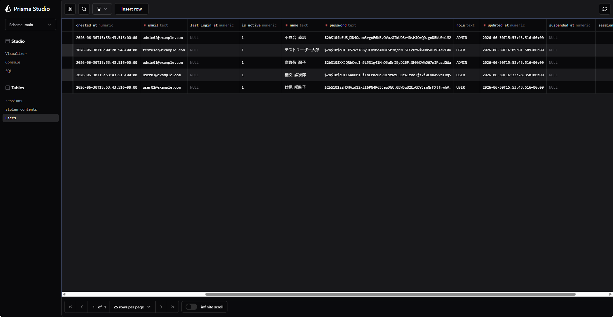
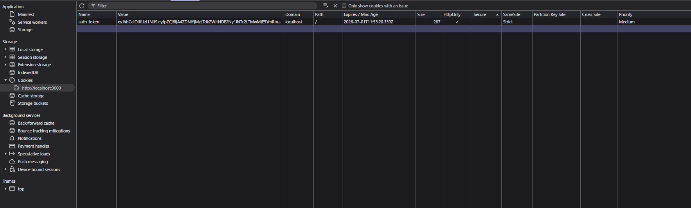
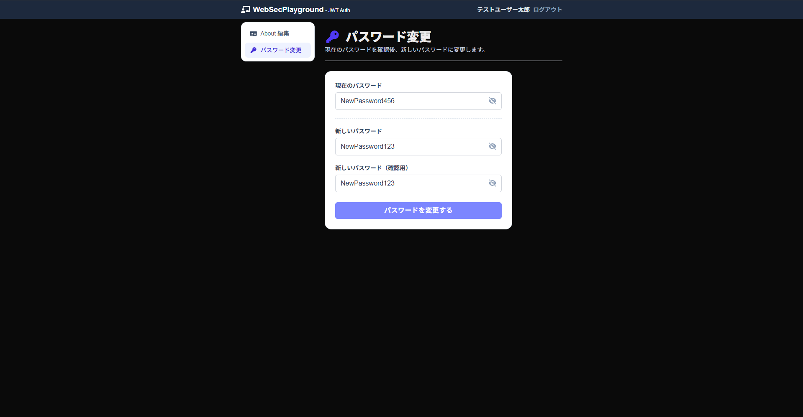
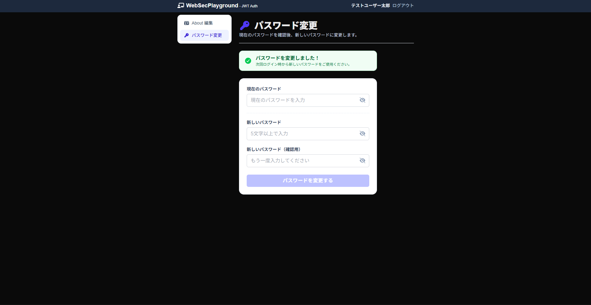
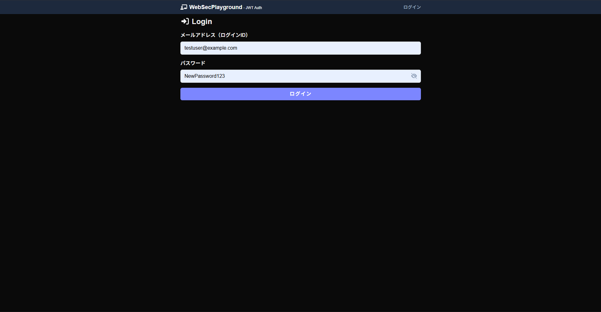
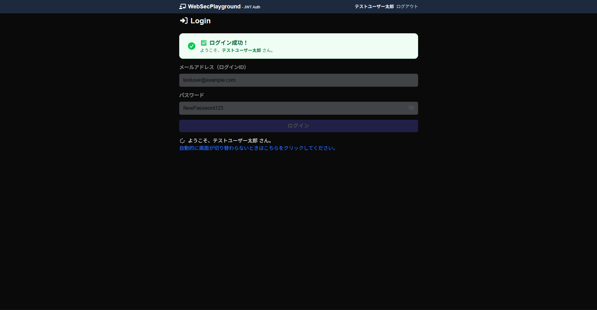
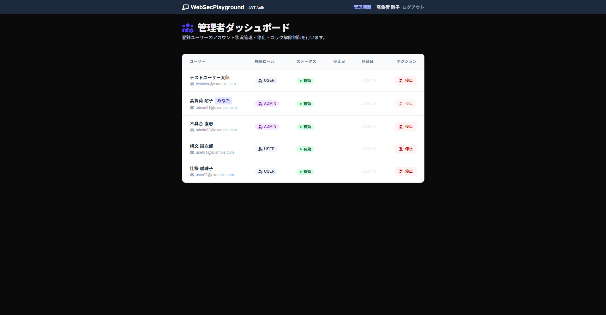
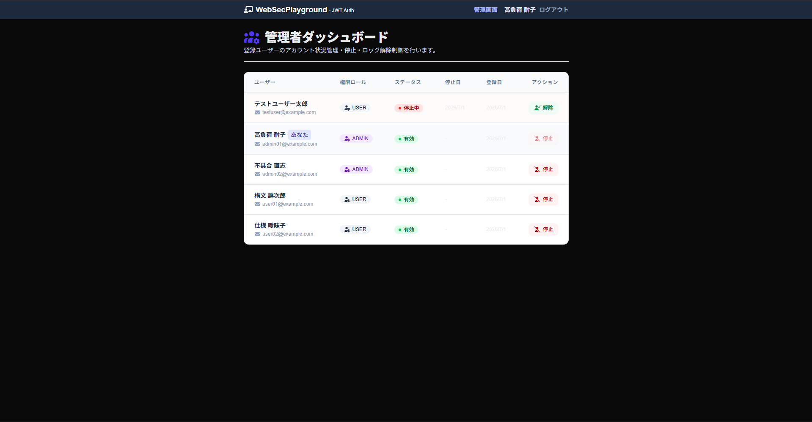
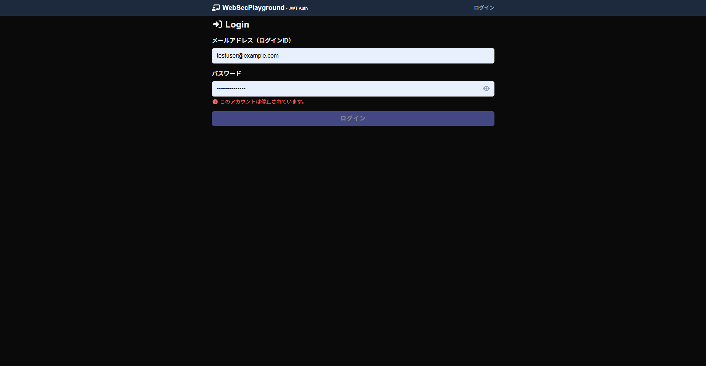

# nextjs-secure-auth-playground

本アプリケーションは、Next.js (App Router) と SQLite/Prisma を使用して構築された、セキュアな認証・認可機能を備えたユーザー管理システムです。
配布教材 `web-sec-playground-2` をベースに、セキュリティ対策の強化（CookieベースのJWT保存への完全移行、パスワードハッシュ化）と、2つの追加機能を実装しました。

---

## 動作検証（スクリーンショット）

課題の要件に基づき、ローカル環境（`localhost:3000`）での各機能の動作確認結果を以下に掲載します。

### 1. 新規登録とパスワードのハッシュ化確認
新規サインアップ実行後、Prisma Studioで確認したデータベース上の値です。パスワードが平文ではなく、安全にハッシュ化されて保存されていることが確認できます。


### 2. セキュリティ属性（HttpOnly等）が付与されたCookieの確認
ログイン成功後、ブラウザ（デベロッパーツール）に `auth_token` という名前のCookieが保存されています。`HttpOnly` および `SameSite=Strict` が有効になっていることが確認できます。


### 3. パスワード変更機能の動作確認
一般ユーザーまたは管理者ユーザーが、自身のパスワードを安全に変更し、新しいパスワードで再ログインに成功するまでの一連のフローです。（※テスト用に一部パスワードを表示しています）

#### ① パスワード変更画面の入力
パスワード変更画面（`/member/change-password`）にて、現在のパスワードと新パスワードを入力している様子です。


#### ② パスワード変更の完了
「パスワードを変更する」ボタンをクリックし、パスワードが安全にハッシュ化されてDBが更新され、成功メッセージが表示された画面です。


#### ③ 新しいパスワードでのログイン入力
ログアウト後、ログイン画面（`/login`）にて、先ほど変更した新しいパスワードを入力してログインを試みている様子です。


#### ④ ログイン成功
変更後の新しいパスワードを使用して、問題なくログインに成功し、マイページへ遷移した画面です。


### 4. 管理者専用ダッシュボード
管理者（ADMINロール）アカウントでのみアクセス可能な管理画面（`/admin/users`）にて、一般ユーザーのアカウント状態を動的に制御する動作フローです。

#### ① 管理者ダッシュボードの初期状態
全登録ユーザーが一覧表示されている初期画面です。


#### ② 特定ユーザー（testuser）の停止実行
ユーザー「テストユーザー太郎（testuser@example.com）」の右側にある「停止」ボタンをクリックし、ステータスを「有効」から「無効（停止中）」へ切り替えた画面です。該当行の背景色が変わり、停止日時が記録されていることが確認できます。


### 5. 停止されたアカウントでのログイン制限
管理者によってアカウントを「無効（停止中）」に設定されたユーザーがログインを試みた際、API側で即座に検知され、エラーを返してアクセスを完全にブロックしている画面です。


---

## 1. セキュリティ対策の技術的詳細

### 1.1 パスワードのハッシュ化（bcryptjs）

**使用ライブラリ：** `bcryptjs`

#### 処理内容
ユーザーが入力したパスワードは、以下のフローで**一方向ハッシュ化**されて保存されます：

```
[ユーザー入力] → bcrypt.hash(password, 10) → [64文字のハッシュ文字列] → [DB保存]
```

- **コスト値10：** ハッシュ化に計算量を費やすことで、ブルートフォース攻撃の計算時間を長期化させます。
- **ソルト自動付与：** 同じパスワードでも毎回異なるハッシュが生成されるため、レインボーテーブル攻撃を防ぎます。

#### 実装箇所
| ファイル | 処理 |
|---------|------|
| `src/app/_actions/signup.ts` | 新規登録時：`await bcrypt.hash(payload.password, 10)` |
| `src/app/api/login/route.ts` | ログイン時：`await bcrypt.compare(inputPassword, dbPassword)` |
| `src/app/api/account/change-password/route.ts` | パスワード変更時：新パスワードを再度ハッシュ化 |
| `prisma/seed.ts` | シードデータ：すべてのテストユーザーをハッシュ化 |

#### 防衛効果
- **データベース漏洩時：** ハッシュ化されたパスワードからは元のパスワードを復元不可。
- **レインボーテーブル攻撃無効化：** ソルト付与により、同じパスワードでも毎回異なるハッシュになるため、事前計算テーブルが無意味に。
- **ブルートフォース攻撃耐性：** コスト値10により、1パスワードの試行に約100msかかり、大量の自動テストを困難にします。

---

### 1.2 Cookie属性によるXSS・CSRF・盗聴対策

JWTトークンは、以下の3つのセキュリティ属性で保護されたCookieに格納されます。

**実装箇所：** `src/app/api/login/route.ts`

```typescript
cookieStore.set("auth_token", jwt, {
  httpOnly: true,                                  // XSS対策
  secure: process.env.NODE_ENV === "production",  // 盗聴対策
  sameSite: "strict",                            // CSRF対策
  maxAge: tokenMaxAgeSeconds,                     // 有効期限: 3時間
  path: "/",
});
```

#### 属性別の防衛効果
| 属性 | 設定値 | 対策対象 | 技術詳細 |
|------|-------|--------|---------|
| **HttpOnly** | `true` | XSS（クロスサイトスクリプティング） | JavaScript（`document.cookie`）からアクセス不可。HTMLインジェクション攻撃によるCookie盗難を防止します。 |
| **Secure** | `process.env.NODE_ENV === "production"` | パケット盗聴 | HTTPS接続下でのみ送信。HTTP平文通信を禁止し、中間者攻撃によるCookie傍受を防止します。 |
| **SameSite** | `"strict"` | CSRF（クロスサイトリクエストフォージェリ） | 異なるオリジンからのリクエストにCookieを一切含めない。外部サイトから自動的な認証済みリクエストを送信させないようにします。 |

---

### 1.3 コンテンツセキュリティポリシー（CSP）

**実装箇所：** `next.config.ts`

#### 設定内容
```typescript
const cspHeader = `
  default-src 'self';           // デフォルト: 同一オリジンのリソースのみ読み込み可
  script-src 'self' 'unsafe-eval' 'unsafe-inline';  // スクリプト: 同一オリジン+インライン許可
  style-src 'self' 'unsafe-inline';                 // スタイル: 同一オリジン+インライン許可
  img-src 'self' data: blob:;                       // 画像: 同一オリジン+データURI許可
  font-src 'self';                                  // フォント: 同一オリジンのみ
  object-src 'none';                                // Flash等のプラグイン: 禁止
  base-uri 'self';                                  // <base> タグ: 同一オリジンのみ
  form-action 'self';                               // フォーム送信先: 同一オリジンのみ
  frame-ancestors 'none';                           // <iframe> 埋め込み: 禁止
`;
```

#### 防衛メリット
- **`script-src 'self'`**: 外部からのスクリプト注入を遮断。XSSで攻撃者が悪意あるJavaScriptを実行させようとしても、信頼できるオリジンのみ実行可能にします。
- **`frame-ancestors 'none'`**: クリックジャッキング攻撃を防止します（自サイトを iframe で他サイトに埋め込ませない設計）。
- **`form-action 'self'`**: フィッシング攻撃対策。フォームの送信先を同一オリジンのみに限定します。

---

## 2. 追加機能のディレクトリ構成とソースコード解説

### 2.1 管理者によるユーザー停止機能（isActive フラグ管理）

#### ファイル構成とロジック
| ファイル | 役割 | 詳細 |
|---------|------|------|
| **`src/app/api/_helper/verifyAdmin.ts`** | 認可ガード | リクエストのJWTを検証し、JWTが有効か、ADMINロールか、isActive=true かをDBと照合して検証します。 |
| **`src/app/api/admin/users/route.ts`** | ユーザー一覧取得API | `verifyAdmin` で認可確認後、全ユーザーを取得して返却。 |
| **`src/app/api/admin/users/[id]/toggle-status/route.ts`** | ユーザーステータス切り替えAPI | 認可確認後、指定ユーザーの `isActive` を反転し、`suspendedAt` に停止日時を記録。自己のアカウント停止は防止するロジックを実装。 |
| **`src/app/admin/users/page.tsx`** | 管理画面UI | ユーザーテーブルを表示。各行に「停止/解除」ボタンを配置。 |

---

### 2.2 ユーザーのパスワード変更機能

#### ファイル構成とロジック
| ファイル | 役割 | 詳細 |
|---------|------|------|
| **`src/app/api/account/change-password/route.ts`** | パスワード変更API | 認証確認後、現在のパスワードを `bcrypt.compare` で照合し、一致すれば新パスワードをハッシュ化して更新。 |
| **`src/app/member/change-password/page.tsx`** | パスワード変更フォームUI | ログインユーザー用フォーム画面。zodによるバリデーションと、成功メッセージ表示。 |

---

## 3. ローカル環境セットアップ手順

### 3.1 環境構築前の前提条件
```bash
# 以下がインストール済みであることを確認
$ node --version    # v18 以上推奨
$ npm --version     # v9 以上推奨
```

---

### 3.2 ステップバイステップセットアップ

#### **ステップ1：リポジトリをクローン**
```bash
git clone https://github.com/あなたのユーザー名/nextjs-secure-auth-playground.git
cd nextjs-secure-auth-playground
```

#### **ステップ2：依存パッケージをインストール**
```bash
npm install
```

#### **ステップ3：環境変数を設定**
プロジェクトルートに `.env` ファイルを作成：
```bash
cat > .env << 'EOF'
# SQLite データベースパス（ローカル）
DATABASE_URL="file:./dev.db"

# JWT シークレットキー（デモ用・本番では強力なキーに変更）
JWT_SECRET="ABCDEFG123456789UVWXYZ"
EOF
```

#### **ステップ4：Prisma マイグレーション実行**
Prisma スキーマから SQLite データベーススキーマを生成：
```bash
# スキーマ定義に基づいて dev.db を作成・更新
npx prisma db push
```

#### **ステップ5：Prisma クライアントを生成**
```bash
npx prisma generate
```

#### **ステップ6：シードデータを挿入**
テスト用の管理者・ユーザーを DB に投入：
```bash
# prisma/seed.ts を実行し、ハッシュ化したデータを登録
npx prisma db seed
```

**テスト用の初期アカウントデータ：**
*   **管理者1**: `admin01@example.com` / `password1111`
*   **管理者2**: `admin02@example.com` / `password2222`
*   **ユーザー1**: `user01@example.com` / `password1111`
*   **ユーザー2**: `user02@example.com` / `password2222`

#### **ステップ7：開発サーバーを起動**
```bash
npm run dev
```

#### **ステップ8：ブラウザでアクセス**
```
http://localhost:3000
```

---

### 3.3 開発時に便利なコマンド集
```bash
# Prisma Studio: GUI でデータベースを検閲・編集
npx prisma studio
# → ブラウザで http://localhost:5555 が起動

# データベースをリセット（開発環境のみ）
npx prisma db push --force-reset
```

#### **Q. `prisma db push` でエラーが出る場合の解決策**
```bash
rm -rf node_modules .next dev.db
npm install
npx prisma db push
```
